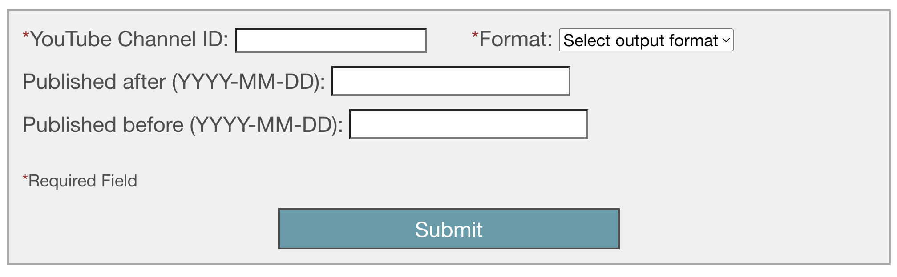
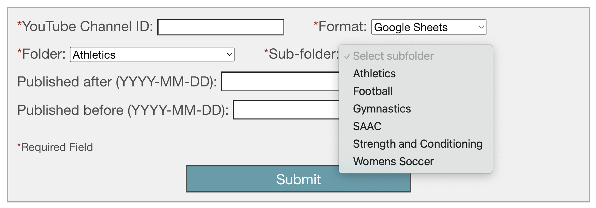
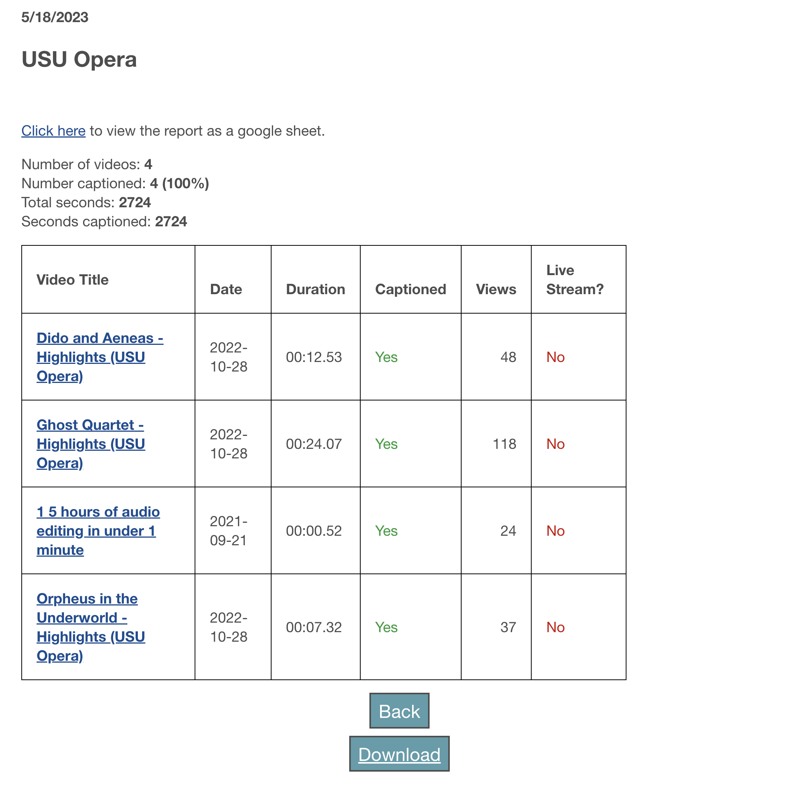
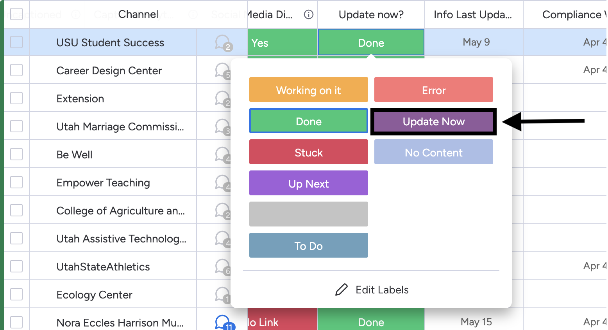

# YouTube Caption Check Tool
* Developed by Emma Lynn (e.lynn@usu.edu)
* Supervised by Christopher Phillips, Electronic & Information Technology Accessibility Coordinator (christopher.phillips@usu.edu)
* On request from Christopher Phillips, Electronic & Information Technology Accessibility Coordinator & Megan Spackman, Caption Program Coordinator

The YouTube Caption Check Tool is a tool developed by Utah State University to audit University affiliated YouTube channels, checking for captions
and other information.

YCCT is currently hosted on AWS and is accessible at: https://master.d18gulj4il0z61.amplifyapp.com/

## Usage

### As a web application:

1. Navigate to [the tool](https://master.d18gulj4il0z61.amplifyapp.com/).

2. Paste the YouTube Channel ID for the channel you would like to audit in the 
specified box.
3. Select the output format:
   * If `HTML` is selected, the report will be output as an HTML table, with an option
   to download.
   * If `Google Sheets` is selected, the report will be displayed as HTML and a 
   new Google sheet will be created in the specified folder.
   
   
   
     * A new input box will appear with the label `Folder`. Please select the outer folder you wish
     to store the google sheet in.
     * Once you select the outer folder, another new input box will appear labelled 
     `Sub-folder`. Please select the subfolder you would like to store the google sheet in.
     * If a folder you're looking for is not available, please contact your developer.
     Coming soon: a more dynamic folder selection option, that will pull options directly
     from Google Drive.
4. (Optional) Add dates for date filtering. Videos will only be audited if they are
within the specified date range.
5. Click submit. Please note that if the channel has a large amount of content,
the application may take a moment to respond after Submit is selected. If sending a 
report to Google Sheets, video results may also take a moment to being loading on the
next page.

6. To download the report as HTML, scroll to the bottom of the page and select `Download`.
If google sheets was selected as the output, the sheet will have been automatically
created and is accessible in the folder you specified and at the link at the top of
the page.

Note: This version of the tool has documented issues generating reports for channels with more than `1000` videos.
It is recommended to use the webhook to generate reports for these large channels. This will be fixed in future versions.

### As a webhook on monday.com

1. Navigate to the YouTube Channels board on monday.com.
2. On the row for the channel you wish to audit, change the `Update now?` column
to `Update Now`. The application will automatically be triggered.

3. The `Update now?` column will change to `Done` after the audit is complete. If
there a new video has been uploaded to the channel since the last audit, the application
will create a google sheet with the video information in the folder specified in the `Reports`
column. 
* If the `Update now?` column changes to `No Content`, the channel was found but
contains no content. 
* If the `Update now?` column changes to `Done` and the `Caption Status` column 
changes to `Deleted`, the channel has been deleted and is no longer accessible publicly
on YouTube. If you are sure the channel exists, check to ensure that the channel ID is
correct.
* The `Update now?` status may change to the `Error` status in the following situations:
  * There is no channel id specified in the `Channel ID` column
  * There is not a link to a folder listed in the `Reports` column
  * The link to the folder listed in the `Reports` column is invalid
  * Another error has occurred. If none of the above are applicable and you are unsure
  why the error occurred, please follow the Bug Report instructions below.

## Current version: 1.0.0
**Features planned for future releases:**
* GUI support for larger channels (`1000+` videos)
* Folder selection directly from Google Drive
* Improved report formatting
* Separate webhook ending statuses for `Updated` and `Up to Date`

## Bug Reports
If something behaves unexpectedly, or you run into a problem with the application,
please let me know.

Send bug reports to a02391851@usu.edu with the subject line 
"Bug Report - YouTube Caption Check".

Please include:
* What you expected to happen
* What actually happened
* The date and approximate time you were using the application
* Any error messages you received
* Any other information that you think could be useful

I will get back to you promptly with an update. Thank you.