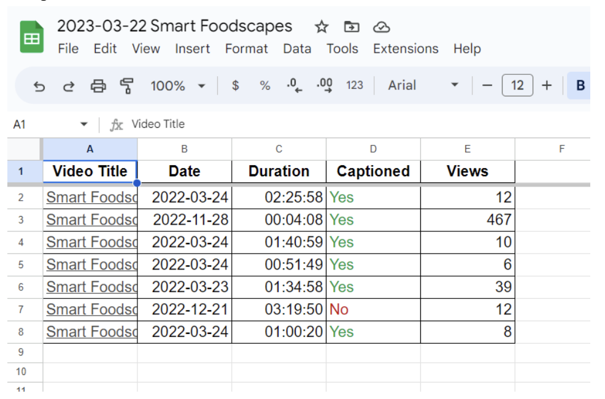

# YTCA Rewrite (YTCA-USU)
Digital Accessibility Services - Utah State University
* Created by Emma Lynn (a02391851@usu.edu)
* Supervised by Christopher Phillips, Electronic & Information Technology Accessibility Coordinator (christopher.phillips@usu.edu)
* On request from Christopher Phillips, Electronic & Information Technology Accessibility Coordinator & Megan Spackman, Caption Program Coordinator

## Project Specs from Megan
### Current Process
* [Overview Video](https://www.loom.com/share/b901ee3be49b4ade8302780633df7195)
* After getting all the overall channel information, we currently have to run a report using the YTCA tool for each channel to get a list of videos the captioned videos, seconds, seconds uncaptioned, the date published, and views that displays as an HTML table.
* We currently have 7 different YouTube API keys that we shuffle through to be able to check all of our videos. Ideally, at some point in the process that switching of API keys could happen automatically OR we get our quota increased from Google (difficult process).
* This report is then copied and pasted into a Google Sheet in a folder for that channel, and then we take the summary information we need and copy and paste it into the Monday board. We then move the previous report to an archives folder  (as you can see a lot of manual work). Here is a video showing this process:  
### Goals
* The goal would be to automate the entire process as much as possible. This would require checking individual videos on each channel. We are hopeful that we can increase our API limit, but may need a solution in the short-term where we cycle through multiple API keys. Here are some thoughts on how to do this:
  * Create YouTube Channel Caption Information Application Service
    * The current YTCA tool is a web app where we manually add channel ID and then it retrieves all the information, however that tool is buggy and has a number of issues that we have struggled to fix. We would like to rewrite this general purpose tool to better meet our specific needs.
    * While we may leverage Monday with this tool - the goal would be to build this as a separate web app outside of Monday that has an API that we could call using Monday.
  * Monday
    * Once the service is built - have a process/button in Monday that works with the current “Update now” button that kicks off this part of the process to pull detailed information from Monday and then pull the relevant summary of that detailed report back into Monday.

### Minimum Viable Product
### Phase 1
Build replacement YTCA functionality. You can see/tryout the current YTCA Tool [here](https://elearn.usu.edu/accessibility/ytca/1/).
* Rebuild the functionality of the current YTCA tool with a more limited feature set we think will only need the following fields:

* YouTube Channel:
  * YouTube Channel ID: Code provided by YouTube to identify channel
* Output:
  * Format: HTML
* Dates:
  * Published after (YYYY-MM-DD): We use these dates to divide channels that have a large amount of videos into certain time ranges.
  * Published before (YYYY-MM-DD):
  
* We can also update the user interface for this to use something like Bootstrap.
* When you press submit it would create a report in an HTML table like in [this example](https://elearn.usu.edu/accessibility/ytca/1/ytca.php?channelid=UCp_UB-VevoEj0BUKPVieTYA&channels=&report=details&output=&filtertype=&filtervalue=&date-start=&date-end=&debug=0&submit=Submit) that would include the following information:

* Summary Information:
  * Number of videos
  * Number captioned
  * Total seconds
  * Seconds captioned
* Table Information:
  * Video Title
  * Date
  * Duration
  * Captioned
  * Views
* Determine if we can pull information on whether a video is unlisted or not. If so, add that information to the report.
  
### Phase 2
Create an API for the report in Phase 1 and create a new output to Google Sheets.
* Currently, the YTCA tool provides us the information in an HTML format that we then copy into Google Sheets.
  * We are hopeful a tool might be built to publish directly to Google Sheets with the table information shown in the Channel Caption Info Report.
    * Have a “Google Sheets” format option in the YouTube Caption Info interface.
    * Be able to select the folder destination - so we would somehow have to link the Google Drive folder with this.
    * When we hit submit in the interface, have it automatically populate a new Google Sheet with the table information.

    * 
    * The name of the document should be “DATE REPORT PULLED + YOUTUBE CHANNEL NAME”

### Phase 3
Create a trigger in Monday that will kick off the process to run a report that will create a Google Sheet for channels with new videos and update the detailed summary information:

* Update the current automation so that if new videos have been detected since it last ran (Most Recent Video), then run the YouTube channel caption tool, create Google Sheet, and update Monday information.
  * Steps:
    * IF New video exists since last update THEN sent Import Channel ID to YouTube Channel Caption Info.
    * Generate a report and add to Google Sheet.
    * Update Monday board information
      * For the Monday board the information we need:
        * Videos captioned
        * Seconds (or minutes/hours)
        * Seconds captioned (We don’t necessarily have to do seconds, it can be minutes or hours if that’s easier.)
          * These all come from the report generated from YTCA.
          * 
      * There are other columns in Monday, but they are generated based off these three columns. (Seconds uncaptioned, hours uncaptioned, caption everything cost). 

## Progress/Notes

### 4.17.23
* Read through project requirements
* Started setting up shell vue project

### 4.18.23
* Finishing todos tutorial
* Beginning to adapt UI

### 4.19.23
* Created dashboard UI

### 4.20.23
* Starting to get YouTube info
* It looks like the original YTCA uses the search queries :/
  * Running it on USU Opera costs 123 units
  * I believe running my tool (when it is complete) on USU Opera will only cost 10 units
  * Cool cool cool

### 4.21.23
* Added the rest of the channel summary data

### 4.24.23
* Fixing duration formatting
* Fixing pagination issue for getting playlist item ids

## TODO
* Date filtering
* Table formatting
* Video on profile

Dependencies:
* Vue

## Sources/References

Vue
* https://developer.mozilla.org/en-US/docs/Learn/Tools_and_testing/Client-side_JavaScript_frameworks/Vue_getting_started
* 

